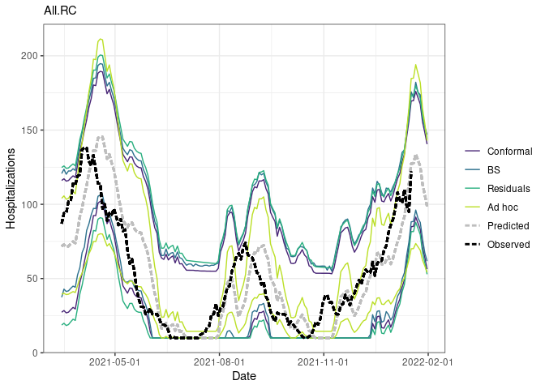
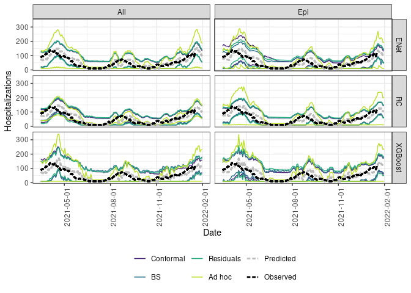
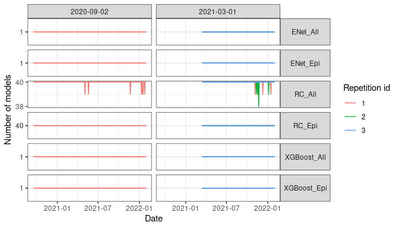
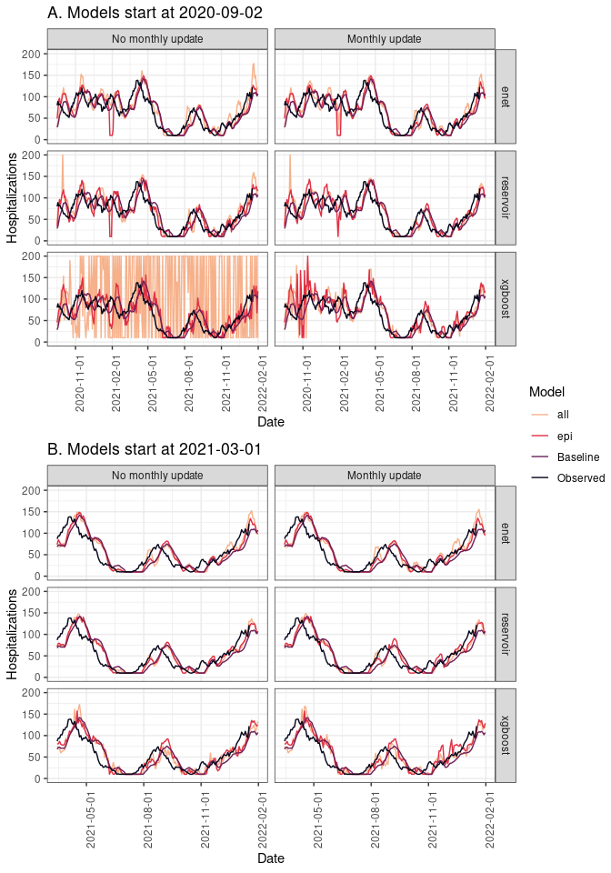
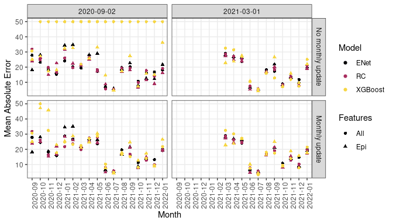
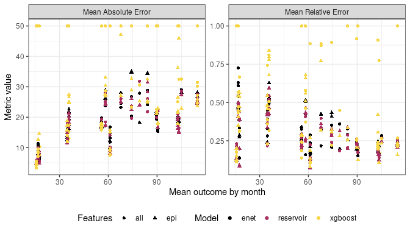
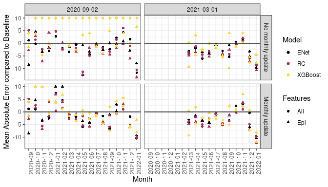
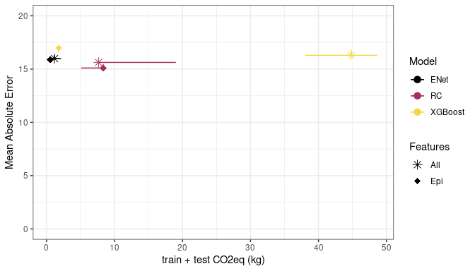
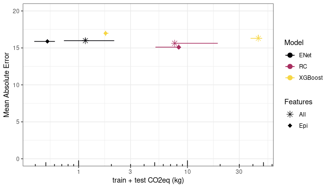

# Experience 1 - reporting

- [1
  Introduction](#introduction)
- [2 Methods](#methods)
- [3 Prediction](#prediction)
  - [3.0.1 Uncertainty
    quantification](#uncertainty-quantification)
  - [3.0.2 Sanity
    check](#sanity-check)
  - [3.0.3
    Prediction](#prediction-1)
  - [3.0.4
    Performance](#performance)
- [4
  Hyperparameters](#hyperparameters)
  - [4.1 Sanity
    check](#sanity-check-1)
  - [4.2 Numeric
    hyperparameters](#numeric-hyperparameters)
    - [4.2.1 Hyperparameter
      evolution](#hyperparameter-evolution)
- [5 Time and carbon
  footprint](#time-and-carbon-footprint)

# Introduction

Goal = provide some results to write the article of the SARS-CoV-2
forecast from an implementation science perspective.

Hypothesis to test :

- Simple models like elastic-net perform better when little information
  is available
- Feature selection based on epidemic knowledge performs better when
  little information is available
- More complex models like xgboost or reservoir computing show an
  advantage only on the late phase of the epidemic
- Simple models are faster and have lighter carbon footprint

# Methods

Same setting as ICML paper.

We compare different scenario :

- 3 methods : elastic-net, xgboost, reservoir computing
- 2 features selection : all features provided (GA feature selection for
  reservoir computing), epidemiology informed features selection (no GA
  feature selection for reservoir computing).
- monthly update and no monthly update
- two period : one starts on 2020-09-02, the other one starts on
  2021-03-01

In order to evaluate the robustness of the results regarding the
variability of reservoir and hyperparameter optimization we repeat the
experiment three times.

Expected results:

- Elastic-net \> xgboost on early period
- Reservoir computing \> Elastic-net on all period (add memory and non
  linearity)
- XGboost ~= Reservoir computing on late period (complex models are
  better in late period)
- Epidemio feature selection \> Data driven feature selection on early
  period (add expert knowledge has strong importance in the early
  period)
- Elastic-net carbon footprint and time \<\<\<\<\< XGboost and Reservoir
  computing

# Prediction

### Uncertainty quantification

### Sanity check

First, we check that there is 40 reservoir prediction for each day of
the prediction for each scenario. At figure
<a href="#fig-sanitycheckNbReservoirPerDay"
class="quarto-xref">Figure 1</a>, we observe that there is indeed a
forecast for each day. Some days have less than 40 reservoirs but the
minimum is 39 which seems acceptable.

Figure 1: Number of reservoir per day for prediction

### Prediction

First we show a graphical evaluation of the different algorithms. On
panel A of figure
<a href="#fig-PredictionByDayByModel" class="quarto-xref">Figure 2</a>
we first observe that xgboost led to highly volatile predictions when
little information is available, persisting when using all features
without updating hyperparameters. At the contrary, both elastic-net and
reservoir computing where quite robust regarding hyperparameter choice.
When more information is available such as presented at panel B, all
models where quite stable and updating the hyperparameters had little
effect.

Regarding the graphical performance at the early phase of the epidemic,
xgboost seemed worse compared to elastic-net and reservoir computing due
to this high volatility. However, when more information is available

Figure 2: Prediction by day by model. Only results of the first
repetition are shown.

### Performance

#### Forecast Error by month

Figure 3: Forecast performance by month depending on model, update
frequency and features used. Erros greater than 50 are set to 50 for
visualisation.

Figure 4: Median Relative Error and Mean Absolute Error depending on
Outcome value. MAE greater than 50 are set to 50 and MRE greater than 1
are set to 1 for visualisation.

Figure 5: Mean Absoluter Error compared to baseline by month depending
on model, update frequency and features used. Models below horitzontal
line underperform compared to baseline model and therefore are useless.
Erros greater than 10 are set to 10 for visualisation.

#### Overall performance

|  |  | starting_date | update | Baseline | MAE (+/- SD) | MRE (+/- SD) | MAEB (+/- SD) | MREB (+/- SD) |
|----|----|----|----|----|----|----|----|----|
| ENet | All | 2020-09-02 | No monthly update | 21.03(±12.45) | 20.47(±13.86) | 0.2(±0.2) | -0.56(±14.04) | 1.02(±12.93) |
|  | All | 2020-09-02 | Monthly update | 21.03(±12.45) | 22.12(±15.73) | 0.22(±0.22) | 1.09(±14.23) | 1.09(±6.47) |
|  | Epi | 2020-09-02 | No monthly update | 21.03(±12.45) | 24.36(±20.26) | 0.23(±0.25) | 3.33(±17.76) | 1.04(±10.89) |
|  | Epi | 2020-09-02 | Monthly update | 21.03(±12.45) | 24.65(±20.54) | 0.23(±0.25) | 3.61(±18.33) | 1.08(±11.34) |
| RC | All | 2020-09-02 | No monthly update | 21.03(±12.45) | 21.54(±18.39) | 0.2(±0.28) | 0.51(±19.52) | 0.86(±7.79) |
|  | All | 2020-09-02 | Monthly update | 21.03(±12.45) | 20.82(±18.42) | 0.2(±0.28) | -0.21(±17.7) | 0.95(±4.49) |
|  | Epi | 2020-09-02 | No monthly update | 21.03(±12.45) | 22.47(±18.41) | 0.21(±0.22) | 1.44(±18.5) | 0.98(±13.12) |
|  | Epi | 2020-09-02 | Monthly update | 21.03(±12.45) | 22.69(±16.69) | 0.24(±0.22) | 1.66(±17) | 1.05(±16.75) |
| XGBoost | All | 2020-09-02 | No monthly update | 21.03(±12.45) | 161.48(±253.34) | 0.88(±3.51) | 140.44(±255.67) | 3.66(±639.63) |
|  | All | 2020-09-02 | Monthly update | 21.03(±12.45) | 28.72(±24.91) | 0.26(±0.38) | 7.68(±23.19) | 1.3(±18.99) |
|  | Epi | 2020-09-02 | No monthly update | 21.03(±12.45) | 24.95(±19.65) | 0.26(±0.27) | 3.91(±19.25) | 1.2(±21.78) |
|  | Epi | 2020-09-02 | Monthly update | 21.03(±12.45) | 31.43(±37.04) | 0.25(±0.41) | 10.39(±36.03) | 1.29(±8.8) |

Performance by algorithm initiated in 2020-09-02 from 2020-09-02 to
2021-03-15

|  |  | starting_date | update | Baseline | MAE | MRE | MAEB | MREB |
|----|----|----|----|----|----|----|----|----|
| ENet | All | 2021-03-01 | No monthly update | 18.59 (18.59 ; 18.59) | 15.83 (15.82 ; 15.87) | 0.29 (0.28 ; 0.29) | -2.76 (-2.77 ; -2.72) | 0.85 (0.85 ; 0.86) |
|  | All | 2021-03-01 | Monthly update | 18.59 (18.59 ; 18.59) | 15.98 (15.9 ; 16.29) | 0.28 (0.28 ; 0.3) | -2.6 (-2.68 ; -2.29) | 0.89 (0.88 ; 0.9) |
|  | Epi | 2021-03-01 | No monthly update | 18.59 (18.59 ; 18.59) | 15.96 (15.86 ; 16) | 0.29 (0.29 ; 0.3) | -2.62 (-2.73 ; -2.58) | 0.91 (0.9 ; 0.91) |
|  | Epi | 2021-03-01 | Monthly update | 18.59 (18.59 ; 18.59) | 15.88 (15.81 ; 15.89) | 0.29 (0.28 ; 0.29) | -2.7 (-2.77 ; -2.7) | 0.91 (0.9 ; 0.91) |
| RC | All | 2021-03-01 | No monthly update | 18.59 (18.59 ; 18.59) | 15.4 (15.24 ; 15.6) | 0.27 (0.24 ; 0.28) | -3.19 (-3.35 ; -2.99) | 0.86 (0.85 ; 0.87) |
|  | All | 2021-03-01 | Monthly update | 18.59 (18.59 ; 18.59) | 15.63 (15.59 ; 15.65) | 0.27 (0.25 ; 0.28) | -2.96 (-3 ; -2.93) | 0.86 (0.85 ; 0.88) |
|  | Epi | 2021-03-01 | No monthly update | 18.59 (18.59 ; 18.59) | 15.16 (15.05 ; 17.45) | 0.25 (0.25 ; 0.32) | -3.43 (-3.53 ; -1.14) | 0.86 (0.83 ; 0.97) |
|  | Epi | 2021-03-01 | Monthly update | 18.59 (18.59 ; 18.59) | 15.1 (14.96 ; 15.46) | 0.25 (0.25 ; 0.28) | -3.48 (-3.62 ; -3.12) | 0.83 (0.8 ; 0.87) |
| XGBoost | All | 2021-03-01 | No monthly update | 18.59 (18.59 ; 18.59) | 16.08 (15.98 ; 19.95) | 0.27 (0.24 ; 0.37) | -2.51 (-2.61 ; 1.36) | 0.88 (0.84 ; 1.12) |
|  | All | 2021-03-01 | Monthly update | 18.59 (18.59 ; 18.59) | 16.29 (16.26 ; 16.78) | 0.29 (0.27 ; 0.32) | -2.29 (-2.33 ; -1.8) | 0.92 (0.89 ; 0.93) |
|  | Epi | 2021-03-01 | No monthly update | 18.59 (18.59 ; 18.59) | 16.44 (16.42 ; 16.97) | 0.28 (0.28 ; 0.31) | -2.15 (-2.17 ; -1.62) | 0.93 (0.88 ; 0.95) |
|  | Epi | 2021-03-01 | Monthly update | 18.59 (18.59 ; 18.59) | 16.99 (16.61 ; 17.32) | 0.32 (0.31 ; 0.33) | -1.59 (-1.97 ; -1.27) | 0.89 (0.84 ; 0.97) |

Performance by algorithm initiated in 2021-03-01 from 2021-03-15 to
2022-01-17.

# Hyperparameters

## Sanity check

## Numeric hyperparameters

### Hyperparameter evolution

Figure 6: Numeric hyperparameter, density of 40 best individuals per
hyperparameter update date.

# Time and carbon footprint

Figure 7: Mean Absolute Error and Carbon footprint by algorithm starting
at 2021-03-01.

Figure 8: Mean Absolute Error and Carbon footprint by algorithm starting
at 2021-03-01.

